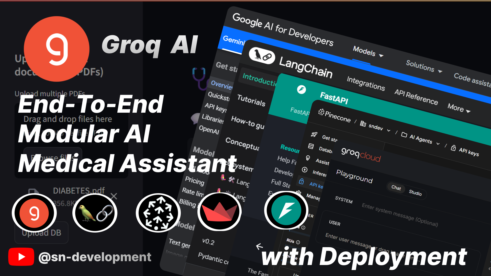

# 📅 Medical Assistant Chatbot — RAG-based Application



> 🎥 **Watch the full project walkthrough:** [YouTube Video](https://youtube.com/your-video-link)
>
> 🗂️ **Architecture PDF:** [View Architecture](./assets/MedicalAssistant.pdf)

---

## 🧠 Project Overview

This application is a **Medical Domain Chatbot** built using **Retrieval-Augmented Generation (RAG)**. It allows users to upload their own medical documents (e.g., textbooks, reports), and the system intelligently answers queries by retrieving the most relevant content before generating a final response.

---

## 🎓 What is RAG?

**RAG (Retrieval-Augmented Generation)** enhances language models by supplying relevant external context from a knowledge base, preventing hallucinations and improving accuracy, especially for factual or specialized domains like **medicine**.

---

## 🔄 Architecture

```
User Input
   ↓
Query Embedding → Pinecone Vector DB ← Embedded Chunks ← Chunking ← PDF Loader
   ↓
Retrieved Docs
   ↓
     RAG Chain (Groq + LangChain)
   ↓
LLM-generated Answer
```

For a detailed view, refer to the **[MedicalAssistant.pdf](./assets/MedicalAssistant.pdf)**

---

## 📚 Features

- Upload medical PDFs (notes, books, etc.)
- Auto-extracts text and splits into semantic chunks
- Embeds using Google/BGE embeddings
- Stores vectors in **Pinecone DB**
- Uses **Groq's LLaMA3-70B** via LangChain
- FastAPI backend with endpoints for file upload and Q\&A

---

## 🌐 Tech Stack

| Component  | Tech Used                  |
| ---------- | -------------------------- |
| LLM        | Groq API (LLaMA3-70B)      |
| Embeddings | Google Generative AI / BGE |
| Vector DB  | Pinecone                   |
| Framework  | LangChain                  |
| Backend    | FastAPI                    |
| Deployment | Render                     |

---

## 📚 API Endpoints

```http
POST /upload_pdfs/
- Upload one or more PDF files

POST /ask/
- Ask a question
- Form field: `question`

GET /test
- Health check endpoint
```

---

## 📁 Folder Structure

```
.
├── server/
│   ├── main.py
│   ├── modules/
│   │   ├── load_vectorstore.py
│   │   ├── llm.py
│   │   ├── query_handler.py
│   │   └── pdf_handler.py
│   └── logger.py
├── client/            # (Optional frontend)
├── assets/
│   ├── thumbnail.png
│   └── architecture.pdf
├── requirements.txt
└── README.md
```

---

## ⚡ Quick Setup

```bash
# Clone the repo
$ git clone https://github.com/your-username/medical-rag-chatbot.git
$ cd medical-rag-chatbot/server

# Create virtual env
$ python -m venv venv
$ source venv/bin/activate  # Windows: venv\Scripts\activate

# Install dependencies
$ pip install -r requirements.txt

# Set environment variables (.env)
GOOGLE_API_KEY=...
GROQ_API_KEY=...
PINECONE_API_KEY=...

# Run the server
$ uvicorn main:app --reload --port 8000
```

---

## 🌐 Deployment

- Hosted on [Render](https://render.com)
- Configure `start command` as:

  ```bash
  uvicorn main:app --host 0.0.0.0 --port 10000
  ```

- Install `python-multipart` for FastAPI form data support:

  ```bash
  pip install python-multipart
  ```

---

## 🌟 Credits

- Built by \[Your Name]
- Inspired by LangChain, Groq, Pinecone, and FastAPI ecosystems

---

## 🎉 License

This project is licensed under the MIT License.
